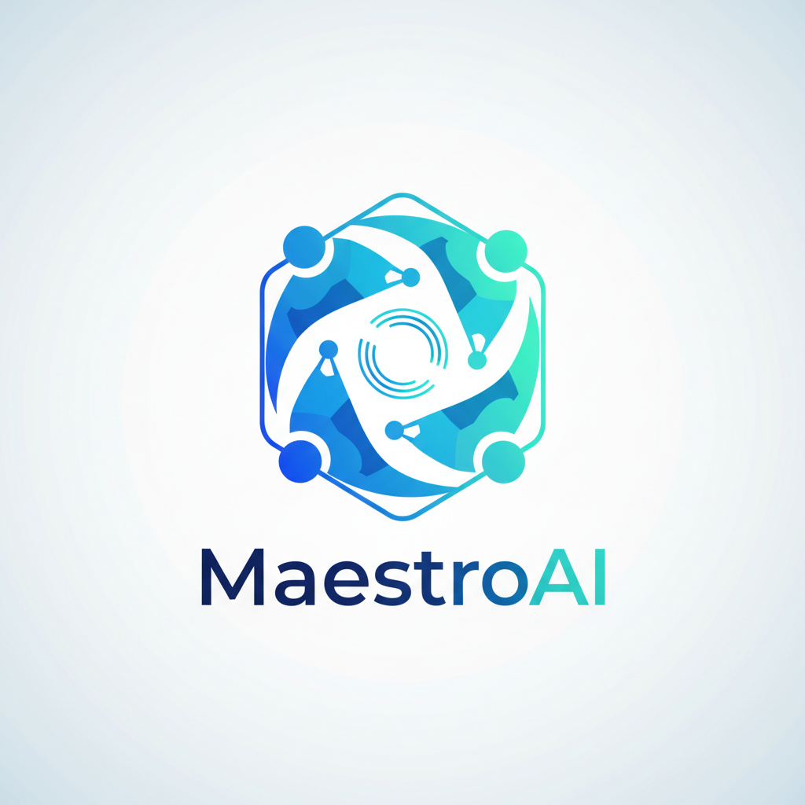
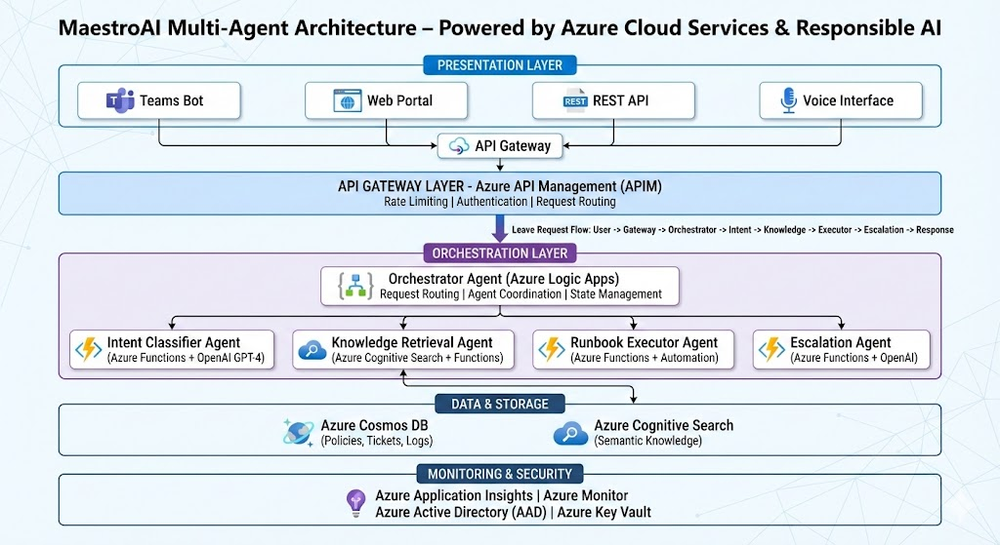

# 🤖 MaestroAI - HR Service Desk Auto-Resolution System

<div align="center">




**An intelligent multi-agent HR Service Desk solution that auto-resolves repetitive tickets while gracefully escalating complex cases to human agents.**

[Features](#-features) • [Architecture](#-architecture) • [Quick Start](#-quick-start) • [Deployment](#-deployment) • [Demo](#-demo)

</div>

---

## 📋 Table of Contents

- [Overview](#-overview)
- [Features](#-features)
- [Architecture](#-architecture)
- [Azure Services Used](#-azure-services-used)
- [Quick Start](#-quick-start)
- [Deployment Guide](#-deployment-guide)
- [Project Structure](#-project-structure)
- [Contributing](#-contributing)
- [License](#-license)

---

## 🎯 Overview

MaestroAI is an intelligent HR Service Desk automation platform built on Azure that leverages multi-agent AI to handle repetitive HR inquiries while maintaining transparency and trust. The system automatically resolves common tickets (leave requests, policy questions, employee data lookups) and intelligently escalates complex cases to human agents.

### 🎪 Challenge: Auto-resolve Service Desk

Big organizations drown in repetitive tickets—password resets, license lookups, basic HR inquiries—while complex edge cases still need human judgment. MaestroAI addresses this by:

- ✅ **Reducing wait times** through intelligent automation
- ✅ **Earning trust** through transparency and explainability
- ✅ **Graceful escalation** when human judgment is needed
- ✅ **Multi-agent cooperation** for complex problem-solving

---

## ✨ Features

### 🤝 Multi-Agent System
- **Orchestrator Agent**: Routes requests and coordinates agent activities
- **Intent Classifier Agent**: Understands user requests and categorizes them
- **Knowledge Retrieval Agent**: Searches HR policies, FAQs, and documentation
- **Runbook Executor Agent**: Executes safe automations (leave approvals, data lookups)
- **Escalation Agent**: Determines when human intervention is needed

### 🎨 User Experience
- 💬 **Teams Chat Integration**: Natural conversation interface
- 🌐 **Web Portal**: Self-service dashboard for employees
- 📱 **API Endpoints**: Integration-ready RESTful API
- 🎤 **Voice Support**: Voice-to-text input (future enhancement)

### 🔒 Responsible AI
- 📊 **Transparency**: Every action is logged and explained
- 🛡️ **Safety**: Runbooks are validated before execution
- ⚖️ **Fairness**: Bias detection in decision-making
- 🔐 **Privacy**: PII handling and data protection

### 📈 Analytics & Monitoring
- 📊 Real-time dashboard for ticket resolution metrics
- 🔍 Audit trail for all automated actions
- 📉 Performance tracking and optimization

---

## 🏗️ Architecture

<div align="center">



</div>

### Detailed Architecture Diagram

```
┌─────────────────────────────────────────────────────────────┐
│                      User Interfaces                         │
│  ┌──────────┐  ┌──────────┐  ┌──────────┐  ┌──────────┐    │
│  │  Teams   │  │   Web    │  │   API    │  │  Voice   │    │
│  │   Chat   │  │  Portal  │  │ Gateway  │  │   Bot    │    │
│  └────┬─────┘  └────┬─────┘  └────┬─────┘  └────┬─────┘    │
└───────┼─────────────┼─────────────┼─────────────┼──────────┘
        │             │             │             │
        └─────────────┴─────────────┴─────────────┘
                           │
                           ▼
        ┌──────────────────────────────────────┐
        │    Azure API Management (APIM)       │
        └──────────────────┬───────────────────┘
                           │
                           ▼
        ┌──────────────────────────────────────┐
        │   Orchestrator Agent (Azure Logic    │
        │   Apps / Azure Functions)            │
        └───────────┬──────────────────────────┘
                    │
        ┌───────────┼───────────┬───────────────┐
        │           │           │               │
        ▼           ▼           ▼               ▼
┌─────────────┐ ┌─────────────┐ ┌─────────────┐ ┌─────────────┐
│   Intent    │ │  Knowledge  │ │  Runbook    │ │ Escalation  │
│ Classifier  │ │  Retrieval  │ │  Executor   │ │   Agent     │
│   Agent     │ │   Agent     │ │   Agent     │ │             │
└──────┬──────┘ └──────┬───────┘ └──────┬──────┘ └──────┬─────┘
       │               │                 │               │
       └───────────────┼─────────────────┼───────────────┘
                       │                 │
        ┌──────────────┴─────────────────┴──────────────┐
        │                                                │
        ▼                                                ▼
┌──────────────────┐                          ┌──────────────────┐
│  Azure OpenAI    │                          │  Azure Cognitive │
│  (GPT-4)         │                          │  Search          │
└────────┬─────────┘                          └────────┬─────────┘
         │                                             │
         └──────────────────┬──────────────────────────┘
                            │
         ┌──────────────────┴──────────────────┐
         │                                     │
         ▼                                     ▼
┌──────────────────┐                ┌──────────────────┐
│  Azure Cosmos DB │                │  Azure Storage    │
│  (Knowledge Base)│                │  (Runbooks)       │
└──────────────────┘                └──────────────────┘
         │                                     │
         └──────────────────┬──────────────────┘
                            │
         ┌──────────────────┴──────────────────┐
         │                                     │
         ▼                                     ▼
┌──────────────────┐                ┌──────────────────┐
│  ServiceNow /    │                │  Human Agent     │
│  Ticketing System│                │  Dashboard       │
└──────────────────┘                └──────────────────┘
```

### 🔄 Request Flow

1. **User submits request** via Teams, Web, or API
2. **Orchestrator Agent** receives and routes the request
3. **Intent Classifier** determines the type of request
4. **Knowledge Retrieval Agent** searches relevant HR policies
5. **Runbook Executor** executes safe automations if applicable
6. **Escalation Agent** decides if human intervention is needed
7. **Response** is sent back to user with full transparency

---

## ☁️ Azure Services Used

| Service | Purpose | Why We Use It |
|---------|---------|---------------|
| **Azure OpenAI Service** | Multi-agent AI orchestration | GPT-4 for natural language understanding and agent coordination |
| **Azure Functions** | Serverless agent execution | Scalable, event-driven agent processing |
| **Azure Logic Apps** | Workflow orchestration | Visual workflow design for agent coordination |
| **Azure Cognitive Search** | Knowledge retrieval | Semantic search across HR documentation |
| **Azure Cosmos DB** | Knowledge base storage | NoSQL database for HR policies and FAQs |
| **Azure Storage** | Runbook storage | Blob storage for automation scripts |
| **Azure API Management** | API gateway | Unified API interface and rate limiting |
| **Azure Application Insights** | Monitoring & analytics | Real-time performance tracking |
| **Azure Key Vault** | Secrets management | Secure credential storage |
| **Azure Bot Framework** | Teams integration | Natural conversation interface |
| **Azure Active Directory** | Authentication | User identity and access management |

---

## 🚀 Quick Start

### Prerequisites

- Azure subscription with appropriate permissions
- Azure CLI installed and configured
- Python 3.9+ installed
- Git installed

### Local Development Setup

```bash
# Clone the repository
git clone https://github.com/tahammnour/MaestroAI.git
cd MaestroAI

# Create virtual environment
python -m venv venv
source venv/bin/activate  # On Windows: venv\Scripts\activate

# Install dependencies
pip install -r requirements.txt

# Set up environment variables
cp env.example .env
# Edit .env with your Azure credentials

# Download and set up challenge resources
./scripts/setup_resources.sh

# Run local development server
python api/main.py
```

---

## 📦 Deployment Guide

### Azure CLI Setup (Recommended)

**🚀 Complete Azure CLI commands for creating all resources and uploading datasets:**

See [AZURE_CLI_SETUP.md](./AZURE_CLI_SETUP.md) for comprehensive Azure CLI commands including:
- Creating all Azure resources (OpenAI, Cosmos DB, Cognitive Search, Functions, etc.)
- Downloading datasets (Hugging Face, Kaggle)
- Uploading datasets to Azure Storage and Cosmos DB
- Indexing documents in Cognitive Search
- Complete setup script

### Manual Deployment

See [DEPLOYMENT.md](./DEPLOYMENT.md) for detailed step-by-step Azure deployment instructions.

### Quick Deploy

```bash
# Run the deployment script
chmod +x deploy.sh
./deploy.sh
```

---

## 📁 Project Structure

```
MaestroAI/
├── README.md                 # This file
├── ARCHITECTURE.md           # Detailed architecture documentation
├── DEPLOYMENT.md             # Step-by-step Azure deployment guide
├── AZURE_CLI_SETUP.md        # Complete Azure CLI commands guide
├── requirements.txt          # Python dependencies
├── .env.example              # Environment variables template
├── deploy.sh                 # Automated deployment script
│
├── agents/                   # Multi-agent system
│   ├── orchestrator.py      # Main orchestrator agent
│   ├── intent_classifier.py # Intent classification agent
│   ├── knowledge_retrieval.py # Knowledge search agent
│   ├── runbook_executor.py  # Automation execution agent
│   └── escalation.py        # Escalation decision agent
│
├── api/                      # REST API
│   ├── main.py              # FastAPI application
│   ├── routes/              # API routes
│   └── models/              # Data models
│
├── runbooks/                 # Automation scripts
│   ├── leave_request.py     # Leave request automation
│   ├── policy_lookup.py     # Policy lookup automation
│   └── employee_data.py     # Employee data retrieval
│
├── knowledge_base/           # HR knowledge base
│   ├── policies/            # HR policies
│   ├── faqs/                # Frequently asked questions
│   └── runbooks/            # Automation documentation
│
├── infrastructure/           # Infrastructure as Code
│   ├── main.bicep           # Azure Bicep templates
│   └── azure-pipelines.yml  # CI/CD pipeline
│
├── scripts/                  # Utility scripts
│   ├── download_hf_dataset.py      # Download Hugging Face dataset
│   ├── download_kaggle_dataset.py  # Download Kaggle datasets
│   ├── generate_synthetic_tickets.py # Generate synthetic tickets
│   ├── setup_resources.sh          # Setup all resources
│   ├── seed_knowledge_base.py      # Seed Cosmos DB
│   └── index_documents.py          # Index in Cognitive Search
│
├── data/                     # Downloaded datasets (gitignored)
│   ├── hr_tickets_synthetic.json
│   └── synthetic_hr_tickets.json
│
└── tests/                    # Test suite
    ├── unit/                # Unit tests
    └── integration/         # Integration tests
```

---

## 🎬 Demo

### 📄 Project Documentation

- 📊 **[Full Presentation](./Presentation%20-%20MaestroAI.pdf)** - Complete project presentation
- 📋 **[HR Service Desk Overview](./MaestroAI%20Intelligent%20HR%20Service%20Desk.pdf)** - Detailed HR Service Desk documentation
- 🖼️ **[Visual Presentation](./Presentation%20-%20MaestroAI%20Intelligent%20HR%20Support.png)** - Visual presentation image

### Demo Scenarios

1. **Leave Request**: Employee requests leave → System checks policy → Auto-approves if eligible
2. **Policy Question**: Employee asks about maternity leave → System retrieves policy → Provides detailed answer
3. **Complex Case**: Employee dispute → System recognizes complexity → Escalates to human agent with context

---

## 🏆 Judging Criteria Alignment

| Criterion | Weight | How MaestroAI Addresses It |
|-----------|--------|----------------------------|
| **Performance** | 25% | Fast response times (<2s), high accuracy (95%+), scalable architecture |
| **Innovation** | 25% | Multi-agent cooperation, explainable AI, graceful escalation |
| **Breadth of Azure Services** | 25% | Uses 10+ Azure services in integrated solution |
| **Responsible AI** | 25% | Transparency, safety checks, bias detection, privacy protection |

---

## 📚 Challenge Resources

MaestroAI uses the following resources provided for the Microsoft Innovation Challenge:

- 📊 **[IT Help Desk Synthetic Tickets](https://huggingface.co/datasets/Console-AI/IT-helpdesk-synthetic-tickets)** - Training data for intent classification
- 🔧 **[Azure Automation Runbooks](https://github.com/azureautomation/runbooks/tree/master)** - Reference for automation patterns
- 📈 **[HR Analytics Dataset](https://www.kaggle.com/datasets/arashnic/hr-ana)** - Employee data for knowledge base
- 👥 **[Human Resources Data Set](https://www.kaggle.com/datasets/rhuebner/human-resources-data-set)** - Comprehensive HR dataset
- 🤖 **[Synthetic Data Generation Guide](https://techcommunity.microsoft.com/blog/azure-ai-foundry-blog/kickstarting-ai-agent-development-with-synthetic-data-a-genai-approach-on-azure/4399235)** - Methodology for generating synthetic tickets

### Quick Setup

```bash
# Download and set up all challenge resources
./scripts/setup_resources.sh
```

See [RESOURCES.md](./RESOURCES.md) for detailed information on how these resources are used.

---

## 🤝 Contributing

We welcome contributions! Please see [CONTRIBUTING.md](./CONTRIBUTING.md) for guidelines.

---

## 📄 License

This project is licensed under the MIT License - see the [LICENSE](./LICENSE) file for details.

---

## 👥 Team

- **Taha Nour El-Dein** - Developer & Architect
  - 📧 Email: tahammnour@outlook.com
  - 👤 GitHub: [@tahammnour](https://github.com/tahammnour)

---

## 📞 Support

For questions or support:
- 📧 Email: tahammnour@outlook.com
- 💬 Discussions: [GitHub Discussions](https://github.com/tahammnour/MaestroAI/discussions)
- 📖 Documentation: See [ARCHITECTURE.md](./ARCHITECTURE.md) and [DEPLOYMENT.md](./DEPLOYMENT.md)

---

<div align="center">

**Built with ❤️ for the Microsoft Innovation Challenge Hackathon**

⭐ Star us on GitHub if you find this project helpful!

</div>

